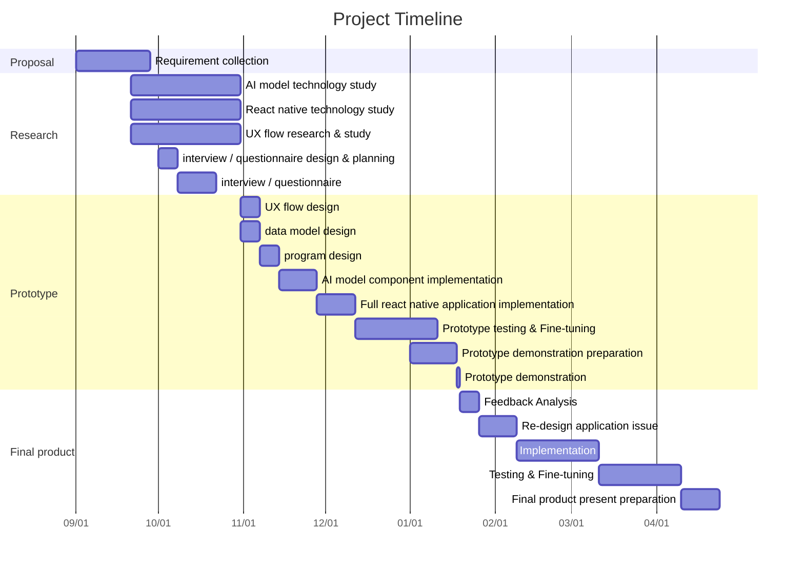

```mermaid
gantt
    title Project Timeline
    dateFormat  YYYY-MM-DD
    axisFormat  %m/%d
    section Proposal 
        Requirement collection       :a1, 2025-09-01, 27d
    section Research 
       AI model technology study :b1, 2025-09-21, 40d
       React native technology study :b2, 2025-09-21, 40d
       UX flow research & study : b3, 2025-09-21, 40d
       interview / questionnaire design & planning : b4, 2025-10-01, 7d
       interview / questionnaire : b5,after b4, 14d
    section Prototype  
        UX flow design : c1, after b3, 7d
        data model design : c2, after b1, 7d
        program design : c3, after c2, 7d
        AI model component implementation : c4, after c3, 14d
        Full react native application implementation : c5, after c4, 14d
        Prototype testing & Fine-tuning: c6, after c5, 30d
        Prototype demonstration preparation: c7,2026-01-01, 17d  
        Prototype demonstration: c8, 2026-01-18, 1d
    section Final product 
        Feedback Analysis: d1, after c8, 7d
        Re-design application issue: d2, after d1, 14d 
        Implementation : d3, after d2, 30d
        Testing & Fine-tuning: d4, after d3, 30d
        Final product present preparation: d5, after d4,14d
```
